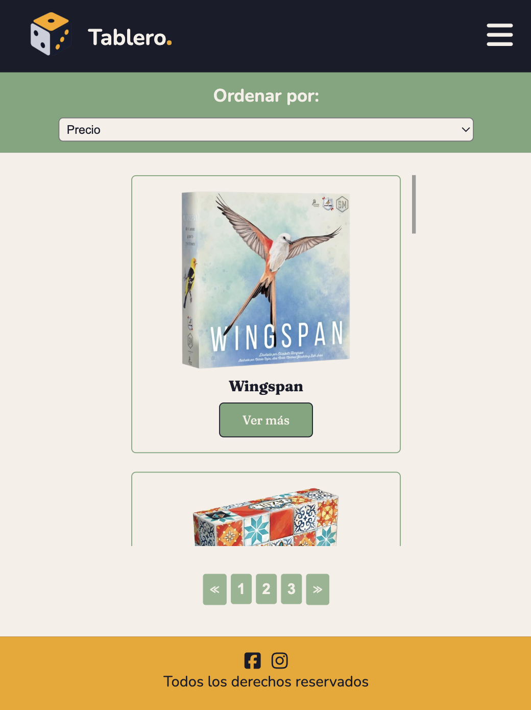
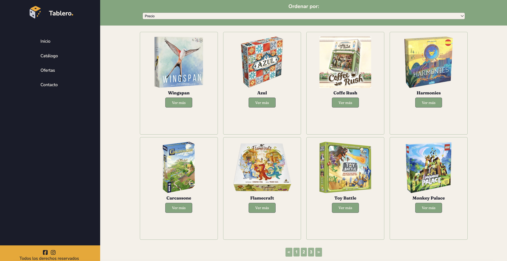
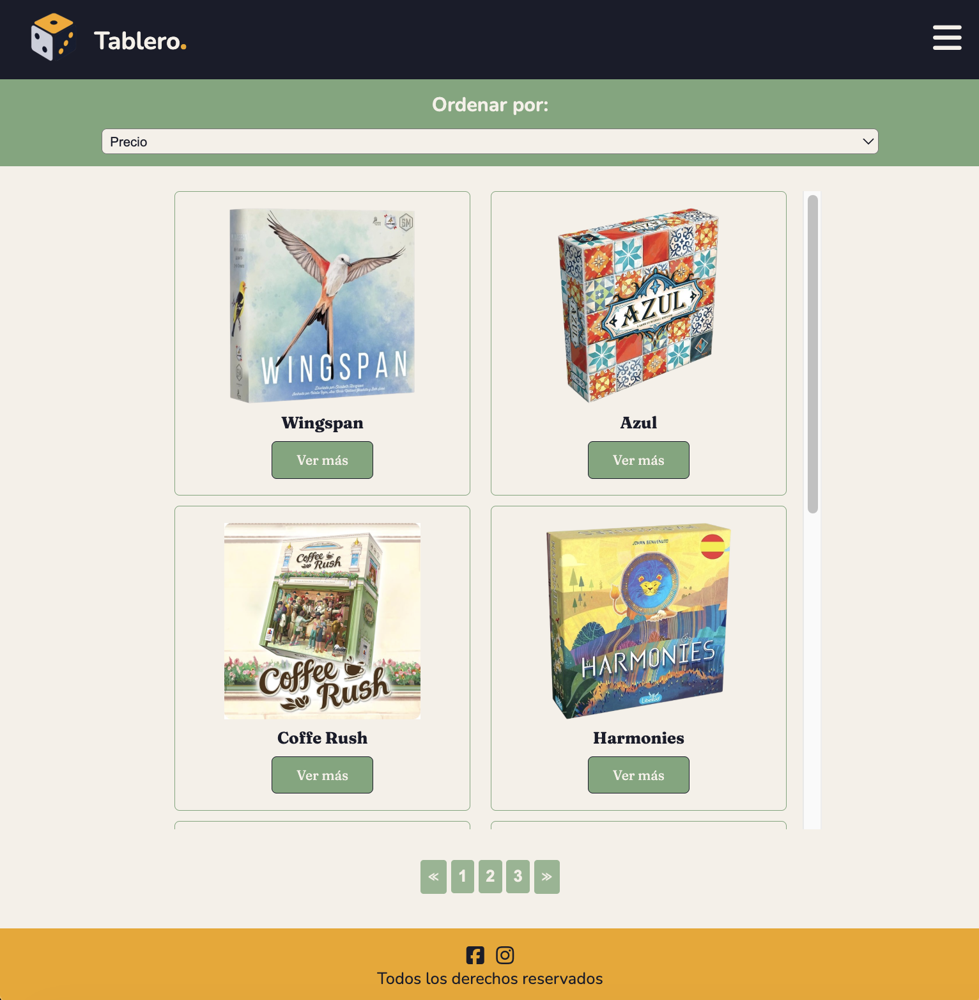

# Tablero — Tienda Online de Juegos de Mesa 
Proyecto de desafío semanal: tienda online temática desarrollada con HTML5 y CSS3, aplicando MediasQueries, CSS Grid y Flexbox para la construcción del layout y los componentes, de manera que sea responsivo en vista mobile y desktop.
___

## Requerimientos del desafío 🏅
1. Diseñar 2 layouts diferentes (Mobile y Escritorio). La versión escritorio se activa sobre los 576px. (3 Puntos)
2. Utilizar CSS Grid y su propiedad grid-template-areas para diseñar los diferentes layouts. (3 Puntos)
3. Utilizar Flexbox para distribuir los elementos dentro de cada sección de los layouts. (2 Puntos)
4. La página web cuenta con 4 secciones: menú de navegación, sección de filtros, sección principal y pie de página. (2 Puntos)
___

## Vista previa 👀
Versión Mobile:


Versión Desktop:


Versión Tablet:


___

## Tecnologías utilizadas 👩🏻‍💻

HTML5 semántico
CSS3 (Grid + Flexbox + Media Queries)
Google Fonts — Fraunces + Nunito
Font Awesome (ícono hamburguesa y redes sociales)
___

## Estructura del layout 📏
El layout principal está construido con CSS Grid usando grid-template-areas:

📱 Mobile (base):
```
.grid-container {
    display: grid;
    grid-template-columns: 1fr;
    grid-template-rows: auto auto 1fr 80px;
    grid-template-areas:
        "navbar"
        "search"
        "main"
        "footer";
}
```
```                    
┌─────────────────┐ 
│     NAVBAR      │
├─────────────────┤
│     SEARCH      │
├─────────────────┤
│      MAIN       │
│  (grilla 1 col) │
├─────────────────┤
│     FOOTER      │
└─────────────────┘
```

💻 Desktop (min-width: 992px):

```
.grid-container {
    grid-template-columns: 20% 1fr;
    grid-template-rows: 6rem 1fr auto;
    grid-template-areas:
        "navbar search"
        "navbar main"
        "footer main";
}
```
```
┌──────────┬──────────────────┐
│          │      SEARCH      │
│  NAVBAR  ├──────────────────┤
│ (sidebar)│                  │
│          │       MAIN       │
├──────────┤  (grilla 4 col)  │
│  FOOTER  │                  │
└──────────┴──────────────────┘
```
___

## Estructura de archivos 📁

```
├── index.html
├── README.md
└── assets/
    ├── css/
    │   └── style.css
    └── img/
        ├── logo_transparent.png
        ├── wingspan.png
        ├── azul_1.png
        ├── coffe_rush.jpg
        ├── harmonies.png
        ├── carcassone.png
        ├── flamecraft.png
        ├── toy_battle.png
        └── monkey_palace.png
```
___

🎀 Autor
Tatiana Manzur M.
Desafío semanal — Bootcamp Desafío Latam
2026